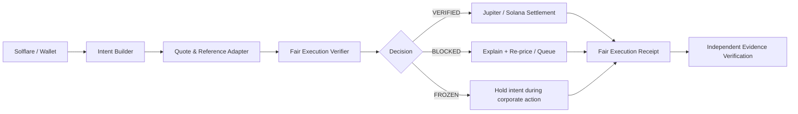
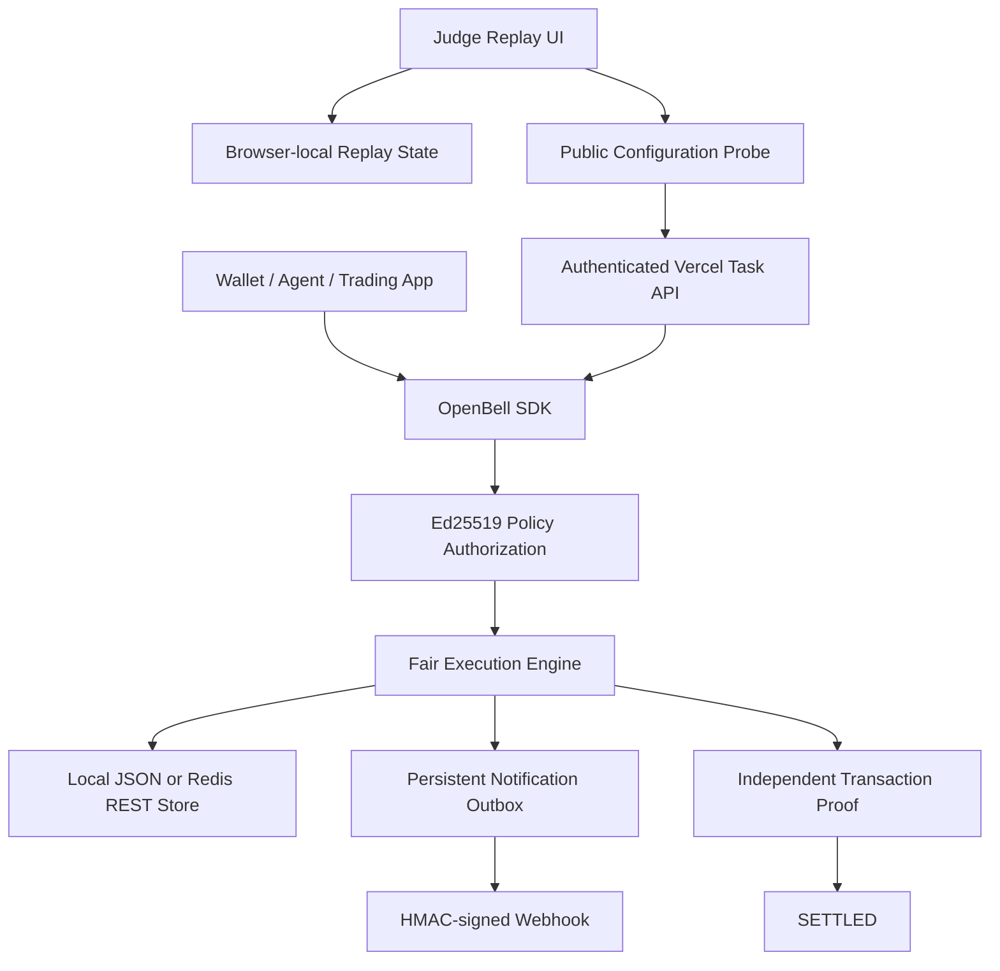

# OpenBell architecture

The protocol separates **market observability** from **execution authority**. An agent can propose an action, but only the verifier can release it. `VERIFIED` means the quote is fresh, within the user's premium/slippage policy, liquid enough, correctly identified, and correctly handles raw/scaled amounts. `BLOCKED` is a recoverable policy refusal. `FROZEN` is a temporary asset-state halt for corporate-action transitions.

## Integration and operations layer

The repository includes in-memory, atomic JSON file, and Upstash-compatible Redis REST adapters. The browser replay is explicitly device-local and contains no signing keys. Anonymous visitors can read only the serverless API's secret-free configuration status; every task operation requires durable remote storage, operator bearer authorization, and a policy signed by the configured trust root. Missing infrastructure produces an explicit `503` instead of an in-memory or ephemeral-filesystem fallback.
