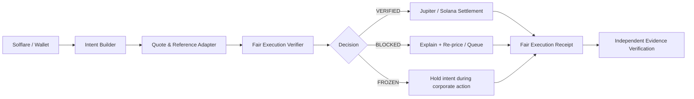
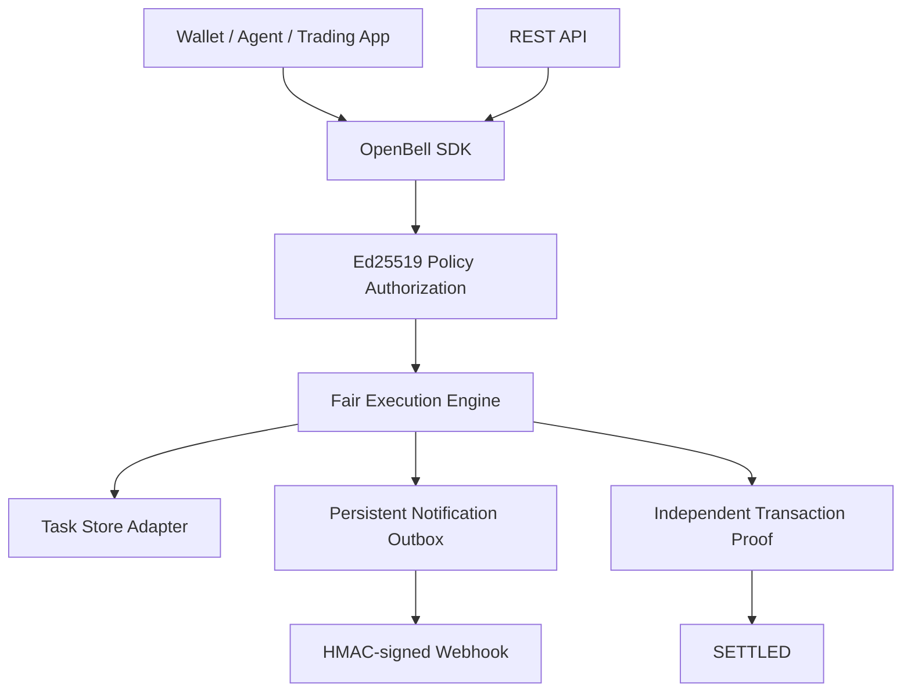

# OpenBell architecture

The protocol separates **market observability** from **execution authority**. An agent can propose an action, but only the verifier can release it. `VERIFIED` means the quote is fresh, within the user's premium/slippage policy, liquid enough, correctly identified, and correctly handles raw/scaled amounts. `BLOCKED` is a recoverable policy refusal. `FROZEN` is a temporary asset-state halt for corporate-action transitions.

## Integration and operations layer

The repository includes an in-memory adapter and an atomic JSON file adapter. The JSON adapter is durable on a local machine or persistent server volume. Serverless filesystems such as Vercel functions are ephemeral; production deployments should provide a transactional store implementing the same interface rather than claiming filesystem persistence.
